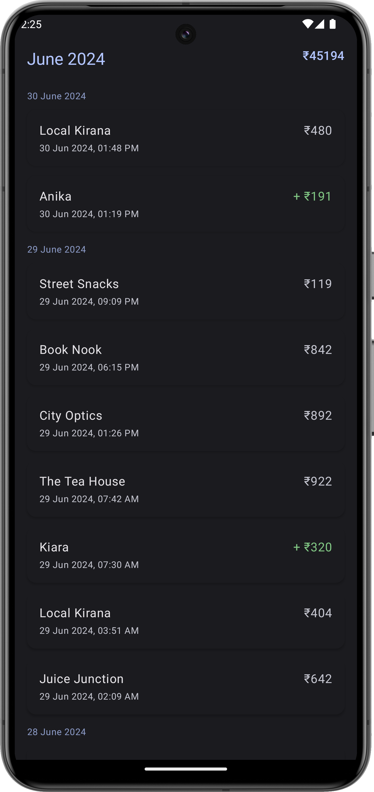

# UPI History 📲💸

Track, view, and analyze all your UPI payments in one place.

---
> ⚠️ **Warning**  
> This app is under active development.  
> All UPI-related SMS messages **may not be parsed correctly yet**.  
> Expect occasional bugs or missing entries as we improve the parsing engine.

## Features ✨

- 📅 View daily and monthly grouped UPI transactions  
- 💰 See transaction amounts with clear debit & credit indicators  
- 📲 Works offline by parsing SMS securely on your device  
- 🔒 Privacy-focused: No data leaves your phone  

---

## Screenshot 📸

  

*Clean list view with grouped transactions*

---

## Installation 🚀

1. Download the latest APK from [Releases](https://github.com/yourusername/upihistory/releases)  
2. Allow SMS permissions when prompted (required for parsing UPI SMS)  
3. Open the app and enjoy full UPI history insight!  

---

## How It Works 🔍

The app reads UPI transaction SMS messages received on your phone as the data source.

